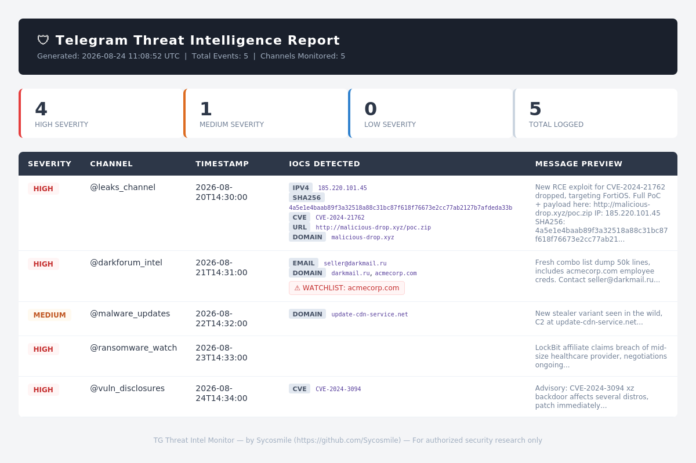

<div align="center">

# 🛡 TG Threat Intel Monitor

**Passively monitors public Telegram channels for CVEs, malware hashes, IPs, domains, and IOCs**

[](./LICENSE)
[](https://github.com/Sycosmile/TG-Threat-Monitor/releases)
[](https://github.com/Sycosmile/TG-Threat-Monitor/actions/workflows/ci.yml)
[](https://www.python.org)
[](https://github.com/Sycosmile)

</div>

A lightweight Python tool that passively monitors public Telegram channels for cybersecurity threat intelligence — CVEs, malware hashes, IPs, domains, and other IOCs — and logs them to a local database with optional VirusTotal enrichment.

## Contents

- [Features](#features)
- [Setup](#setup)
- [Usage](#usage)
- [Project Structure](#project-structure)
- [Example Report](#example-report)
- [CI](#ci)
- [Disclaimer](#disclaimer)
- [License](#license)

## Features

- 📡 Monitors multiple public Telegram channels simultaneously
- 🔍 Extracts IOCs: IPv4, MD5/SHA1/SHA256 hashes, CVE IDs, domains, URLs, emails
- 🎯 Keyword watchlist — get flagged when your target terms appear
- 🦠 Optional VirusTotal enrichment for hashes and IPs
- 🗄 SQLite logging with severity tagging (HIGH / MEDIUM / LOW)
- 📊 One-command HTML report generation
- 🖥 Clean terminal output with color-coded severity

---

## Setup

### 1. Clone the repo
```bash
git clone https://github.com/Sycosmile/TG-Threat-Monitor.git
cd TG-Threat-Monitor
```

### 2. Install dependencies
```bash
pip install -r requirements.txt
```

### 3. Get Telegram API credentials
- Go to [https://my.telegram.org](https://my.telegram.org)
- Log in → API Development Tools → Create App
- Copy your `api_id` and `api_hash`

### 4. Configure
```bash
cp config.example.py config.py
```
Edit `config.py` and fill in:
- `API_ID` and `API_HASH`
- `TARGET_CHANNELS` — public channel usernames to monitor
- `WATCHLIST` — keywords/domains to flag (optional)
- `VT_API_KEY` — VirusTotal API key (optional, free tier available)

---

## Usage

### Start monitoring
```bash
python main.py monitor
```

### Generate HTML report
```bash
python main.py report
```

### View stats
```bash
python main.py stats
```

---

## Project Structure

```
tg-threat-monitor/
├── main.py              # Entry point & CLI
├── config.py            # Your credentials & settings (gitignored)
├── requirements.txt
├── core/
│   ├── monitor.py       # Telethon channel listener
│   ├── parser.py        # IOC extraction & severity scoring
│   ├── database.py      # SQLite logging
│   ├── reporter.py      # HTML report generator
│   └── virustotal.py    # VT API enrichment
├── data/                # SQLite DB & logs (gitignored)
└── output/              # Generated reports (gitignored)
```

---

## Example Report

Generated by `python main.py report` — real output from the actual reporter, shown here with sample data:



---

## CI

This repository includes a GitHub Actions workflow that runs formatting and linters on push and pull requests. The workflow file is located at `.github/workflows/ci.yml`.

## Contributing

See `CONTRIBUTING.md` for contribution guidelines and local lint/format commands.

## Disclaimer

This tool is intended for **authorized security research and threat intelligence purposes only**. Only monitor public channels. Do not use against private accounts or groups without authorization. The author assumes no liability for misuse.

---

## License

MIT License — see the `LICENSE` file for details.
